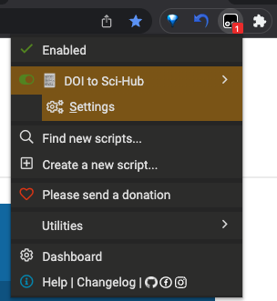
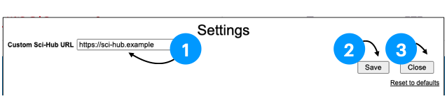
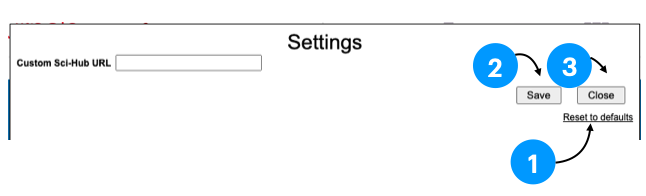

# doi2scihub

A Greasemonkey script to highlight DOI link on the current webpage and redirect it to Sci-Hub.

# Support user-defined base URL
Click `Settings` button to configure custom base URL

## Add custom base URL

1. Enter custom base URL
2. Click `Save` button
3. Click `Close` button to close settings page

## Remove custom base URL

1. Click `Reset to defaults` button
2. Click `Save` button
3. Click `Close` button to close settings page